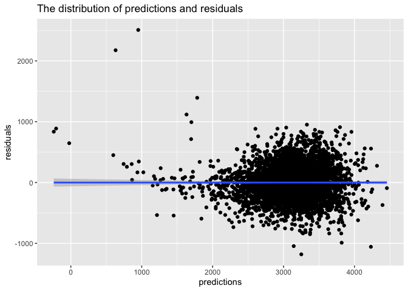

Untitled
================
Shuyi SHEN
11/15/2019

``` r
library(tidyverse)
```

    ## ── Attaching packages ───────────────── tidyverse 1.2.1 ──

    ## ✔ ggplot2 3.2.1     ✔ purrr   0.3.2
    ## ✔ tibble  2.1.3     ✔ dplyr   0.8.3
    ## ✔ tidyr   1.0.0     ✔ stringr 1.4.0
    ## ✔ readr   1.3.1     ✔ forcats 0.4.0

    ## ── Conflicts ──────────────────── tidyverse_conflicts() ──
    ## ✖ dplyr::filter() masks stats::filter()
    ## ✖ dplyr::lag()    masks stats::lag()

``` r
library(broom)
library(modelr)
```

    ## 
    ## Attaching package: 'modelr'

    ## The following object is masked from 'package:broom':
    ## 
    ##     bootstrap

``` r
library(ggplot2)
```

# Problem 1

``` r
birthweight = read.csv("birthweight.csv") %>%
        janitor::clean_names() %>%
  mutate(babysex = factor(babysex),
         frace   = factor(frace),
         malform = factor(malform),
         mrace   = factor(frace))
  

is.na(birthweight) %>% summary()
```

    ##   babysex          bhead          blength           bwt         
    ##  Mode :logical   Mode :logical   Mode :logical   Mode :logical  
    ##  FALSE:4342      FALSE:4342      FALSE:4342      FALSE:4342     
    ##    delwt          fincome          frace          gaweeks       
    ##  Mode :logical   Mode :logical   Mode :logical   Mode :logical  
    ##  FALSE:4342      FALSE:4342      FALSE:4342      FALSE:4342     
    ##   malform         menarche        mheight          momage       
    ##  Mode :logical   Mode :logical   Mode :logical   Mode :logical  
    ##  FALSE:4342      FALSE:4342      FALSE:4342      FALSE:4342     
    ##    mrace           parity         pnumlbw         pnumsga       
    ##  Mode :logical   Mode :logical   Mode :logical   Mode :logical  
    ##  FALSE:4342      FALSE:4342      FALSE:4342      FALSE:4342     
    ##    ppbmi            ppwt           smoken          wtgain       
    ##  Mode :logical   Mode :logical   Mode :logical   Mode :logical  
    ##  FALSE:4342      FALSE:4342      FALSE:4342      FALSE:4342

``` r
fit = lm(bwt~.,data = birthweight)
anova(fit)
```

    ## Analysis of Variance Table
    ## 
    ## Response: bwt
    ##             Df    Sum Sq   Mean Sq   F value    Pr(>F)    
    ## babysex      1   8547634   8547634  114.9013 < 2.2e-16 ***
    ## bhead        1 628838120 628838120 8453.1382 < 2.2e-16 ***
    ## blength      1 140213755 140213755 1884.8193 < 2.2e-16 ***
    ## delwt        1   8647158   8647158  116.2392 < 2.2e-16 ***
    ## fincome      1   4845845   4845845   65.1401 8.960e-16 ***
    ## frace        4  12713426   3178356   42.7250 < 2.2e-16 ***
    ## gaweeks      1   4500541   4500541   60.4984 9.145e-15 ***
    ## malform      1       529       529    0.0071  0.932805    
    ## menarche     1     51223     51223    0.6886  0.406701    
    ## mheight      1    535674    535674    7.2008  0.007315 ** 
    ## momage       1        51        51    0.0007  0.979135    
    ## parity       1    495503    495503    6.6608  0.009888 ** 
    ## ppbmi        1   2621005   2621005   35.2328 3.155e-09 ***
    ## ppwt         1    151601    151601    2.0379  0.153495    
    ## smoken       1   4897471   4897471   65.8341 6.334e-16 ***
    ## Residuals 4323 321592659     74391                        
    ## ---
    ## Signif. codes:  0 '***' 0.001 '**' 0.01 '*' 0.05 '.' 0.1 ' ' 1

``` r
fit_0 = lm(bwt~babysex+bhead+blength+delwt+fincome+frace+gaweeks+mheight+momage+mrace+parity+ppbmi+smoken,data = birthweight)

birthweight %>% 
add_residuals(fit_0) %>% 
add_predictions(fit_0) %>% 
  ggplot(aes(x=pred,y=resid))+geom_point()
```

    ## Warning in predict.lm(model, data): prediction from a rank-deficient fit
    ## may be misleading
    
    ## Warning in predict.lm(model, data): prediction from a rank-deficient fit
    ## may be misleading

<!-- -->
