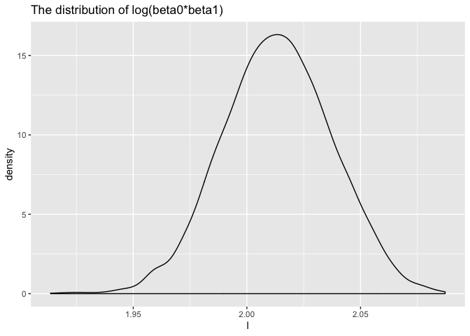

hw6\_ss5929
================
Shuyi SHEN
11/15/2019

``` r
library(tidyverse)
```

    ## ── Attaching packages ───────────

    ## ✔ ggplot2 3.2.1     ✔ purrr   0.3.2
    ## ✔ tibble  2.1.3     ✔ dplyr   0.8.3
    ## ✔ tidyr   1.0.0     ✔ stringr 1.4.0
    ## ✔ readr   1.3.1     ✔ forcats 0.4.0

    ## ── Conflicts ────────────────────
    ## ✖ dplyr::filter() masks stats::filter()
    ## ✖ dplyr::lag()    masks stats::lag()

``` r
library(broom)
library(modelr)
```

    ## 
    ## Attaching package: 'modelr'

    ## The following object is masked from 'package:broom':
    ## 
    ##     bootstrap

``` r
library(ggplot2)
```

# Problem 1

``` r
birthweight = read.csv("birthweight.csv") %>%
        janitor::clean_names() %>%
  mutate(babysex = factor(babysex),
         malform = factor(malform),
         frace   = factor(frace),
         mrace   = factor(mrace))
  

is.na(birthweight) %>% summary()
```

    ##   babysex          bhead          blength           bwt         
    ##  Mode :logical   Mode :logical   Mode :logical   Mode :logical  
    ##  FALSE:4342      FALSE:4342      FALSE:4342      FALSE:4342     
    ##    delwt          fincome          frace          gaweeks       
    ##  Mode :logical   Mode :logical   Mode :logical   Mode :logical  
    ##  FALSE:4342      FALSE:4342      FALSE:4342      FALSE:4342     
    ##   malform         menarche        mheight          momage       
    ##  Mode :logical   Mode :logical   Mode :logical   Mode :logical  
    ##  FALSE:4342      FALSE:4342      FALSE:4342      FALSE:4342     
    ##    mrace           parity         pnumlbw         pnumsga       
    ##  Mode :logical   Mode :logical   Mode :logical   Mode :logical  
    ##  FALSE:4342      FALSE:4342      FALSE:4342      FALSE:4342     
    ##    ppbmi            ppwt           smoken          wtgain       
    ##  Mode :logical   Mode :logical   Mode :logical   Mode :logical  
    ##  FALSE:4342      FALSE:4342      FALSE:4342      FALSE:4342

*comment*

**birthweight**

The dataset includes 20 variables and 4342 observations. There are four
variables including babysex, malform, frace and mrace we need to factor
and there are no NA values after checking.

``` r
fit = lm(bwt~.,data = birthweight)
summary(fit)
```

    ## 
    ## Call:
    ## lm(formula = bwt ~ ., data = birthweight)
    ## 
    ## Residuals:
    ##      Min       1Q   Median       3Q      Max 
    ## -1097.68  -184.86    -3.33   173.09  2344.15 
    ## 
    ## Coefficients: (3 not defined because of singularities)
    ##               Estimate Std. Error t value Pr(>|t|)    
    ## (Intercept) -6265.3914   660.4011  -9.487  < 2e-16 ***
    ## babysex2       28.7073     8.4652   3.391 0.000702 ***
    ## bhead         130.7781     3.4523  37.881  < 2e-16 ***
    ## blength        74.9536     2.0217  37.075  < 2e-16 ***
    ## delwt           4.1007     0.3948  10.386  < 2e-16 ***
    ## fincome         0.2898     0.1795   1.614 0.106551    
    ## frace2         14.3313    46.1501   0.311 0.756168    
    ## frace3         21.2361    69.2960   0.306 0.759273    
    ## frace4        -46.9962    44.6782  -1.052 0.292912    
    ## frace8          4.2969    74.0741   0.058 0.953745    
    ## gaweeks        11.5494     1.4654   7.882 4.06e-15 ***
    ## malform1        9.7650    70.6259   0.138 0.890039    
    ## menarche       -3.5508     2.8951  -1.226 0.220083    
    ## mheight         9.7874    10.3116   0.949 0.342588    
    ## momage          0.7593     1.2221   0.621 0.534418    
    ## mrace2       -151.4354    46.0453  -3.289 0.001014 ** 
    ## mrace3        -91.3866    71.9190  -1.271 0.203908    
    ## mrace4        -56.4787    45.1369  -1.251 0.210901    
    ## parity         95.5411    40.4793   2.360 0.018307 *  
    ## pnumlbw             NA         NA      NA       NA    
    ## pnumsga             NA         NA      NA       NA    
    ## ppbmi           4.3538    14.8913   0.292 0.770017    
    ## ppwt           -3.4716     2.6121  -1.329 0.183913    
    ## smoken         -4.8544     0.5871  -8.269  < 2e-16 ***
    ## wtgain              NA         NA      NA       NA    
    ## ---
    ## Signif. codes:  0 '***' 0.001 '**' 0.01 '*' 0.05 '.' 0.1 ' ' 1
    ## 
    ## Residual standard error: 272.5 on 4320 degrees of freedom
    ## Multiple R-squared:  0.7183, Adjusted R-squared:  0.717 
    ## F-statistic: 524.6 on 21 and 4320 DF,  p-value: < 2.2e-16

``` r
fit_0 = lm(bwt~babysex+bhead+blength+delwt+gaweeks+parity+smoken,data = birthweight)
```

*comment*

After doing t-test to all variables, I build the model by choosing those
having significant effect on bwt according to p-value. For those dummy
variables, only one level is significant will be omitted.

``` r
birthweight %>% 
add_residuals(fit_0) %>% 
add_predictions(fit_0) %>% 
  ggplot(aes(x=pred,y=resid))+geom_point()+
  geom_smooth(method = "lm")+
  labs(
    x = "predictions",
    y = "residuals",
    title = "The distribution of predictions and residuals"
  )
```

<!-- -->
*comment*

According the plot, we can see the points are approximately around 0,
when predictions are larger, residuals will decrease.

## compare the model

``` r
fit_1 = lm(bwt~blength+gaweeks,data=birthweight)
fit_2 = lm(bwt~bhead+blength+babysex, data=birthweight)

cv_df=crossv_mc(birthweight,100)

cv_df %>% pull(train) %>% .[[1]] %>% as_tibble
```

    ## # A tibble: 3,473 x 20
    ##    babysex bhead blength   bwt delwt fincome frace gaweeks malform menarche
    ##    <fct>   <int>   <int> <int> <int>   <int> <fct>   <dbl> <fct>      <int>
    ##  1 2          34      51  3629   177      35 1        39.9 0             13
    ##  2 2          36      50  3345   148      85 1        39.9 0             12
    ##  3 1          34      52  3062   157      55 1        40   0             14
    ##  4 2          34      52  3374   156       5 1        41.6 0             13
    ##  5 1          33      52  3374   129      55 1        40.7 0             12
    ##  6 2          33      46  2523   126      96 2        40.3 0             14
    ##  7 2          33      49  2778   140       5 1        37.4 0             12
    ##  8 1          36      52  3515   146      85 1        40.3 0             11
    ##  9 1          33      50  3459   169      75 2        40.7 0             12
    ## 10 1          35      51  3459   146      55 1        39.4 0             12
    ## # … with 3,463 more rows, and 10 more variables: mheight <int>,
    ## #   momage <int>, mrace <fct>, parity <int>, pnumlbw <int>, pnumsga <int>,
    ## #   ppbmi <dbl>, ppwt <int>, smoken <dbl>, wtgain <int>

``` r
cv_df %>% pull(test) %>% .[[1]] %>% as_tibble
```

    ## # A tibble: 869 x 20
    ##    babysex bhead blength   bwt delwt fincome frace gaweeks malform menarche
    ##    <fct>   <int>   <int> <int> <int>   <int> <fct>   <dbl> <fct>      <int>
    ##  1 1          34      48  3062   156      65 2        25.9 0             14
    ##  2 2          35      51  3317   130      55 1        43.4 0             13
    ##  3 1          35      51  3544   129      65 1        39.6 0             12
    ##  4 2          36      52  3629   154      65 1        40.3 0             11
    ##  5 1          34      52  3203   134      25 1        41.1 0             14
    ##  6 1          34      63  3175   143      25 1        41.9 0             13
    ##  7 1          36      52  3629   152      45 1        39.6 0             11
    ##  8 2          33      49  2948   129      25 1        41   0             13
    ##  9 1          35      51  3345   145      75 1        41.3 0             12
    ## 10 1          35      53  3175   130      45 1        40.4 0             13
    ## # … with 859 more rows, and 10 more variables: mheight <int>,
    ## #   momage <int>, mrace <fct>, parity <int>, pnumlbw <int>, pnumsga <int>,
    ## #   ppbmi <dbl>, ppwt <int>, smoken <dbl>, wtgain <int>

``` r
cv_df=
  cv_df %>% 
  mutate(
    train = map(train,as_tibble),
    test = map(test,as_tibble)
  )


cv_df = 
  cv_df %>% 
  mutate(mod_0  = map(train,
                      ~lm(bwt~babysex+bhead+blength+delwt+fincome+                                            frace+gaweeks+mheight+momage+mrace+parity+ppbmi+smoken,data=.x)),
         mod_1  = map(train, ~lm(bwt~blength+gaweeks,data=.x)),
         mod_2  = map(train, ~lm(bwt~bhead+blength+babysex, data=.x))) %>% 
  mutate(rmse_0 = map2_dbl(mod_0, test, ~rmse(model = .x, data = .y)),
         rmse_1 = map2_dbl(mod_1, test, ~rmse(model = .x, data = .y)),
         rmse_2 = map2_dbl(mod_2, test, ~rmse(model = .x, data = .y)))

cv_df %>% 
  select(starts_with("rmse")) %>% 
pivot_longer(
    everything(),
    names_to = "model", 
    values_to = "rmse",
    names_prefix = "rmse_") %>% 
  mutate(model = fct_inorder(model)) %>% 
  ggplot(aes(x = model, y = rmse)) + geom_violin()
```

<!-- -->

*comment*

According to the plot of rmse, we can see that the model\_0 will have
least rmse which will be prefered. Model\_1 has the highest rmse which
will increase bias. However, we can also see that modeL\_0 has a little
bit greater variance which can be due to much predictors.

# Problem 2

read data

``` r
weather_df = 
  rnoaa::meteo_pull_monitors(
    c("USW00094728"),
    var = c("PRCP", "TMIN", "TMAX"), 
    date_min = "2017-01-01",
    date_max = "2017-12-31") %>%
  mutate(
    name = recode(id, USW00094728 = "CentralPark_NY"),
    tmin = tmin / 10,
    tmax = tmax / 10) %>%
  select(name, id, everything())
```

    ## Registered S3 method overwritten by 'crul':
    ##   method                 from
    ##   as.character.form_file httr

    ## Registered S3 method overwritten by 'hoardr':
    ##   method           from
    ##   print.cache_info httr

    ## file path:          /Users/sfdsfswerw/Library/Caches/rnoaa/ghcnd/USW00094728.dly

    ## file last updated:  2019-09-26 10:23:54

    ## file min/max dates: 1869-01-01 / 2019-09-30

``` r
boot_sample = function(df) {
  sample_frac(df, replace = TRUE)
}


weather_df= weather_df %>% select(tmax,tmin)

boot_straps = 
  data_frame(
    strap_number = 1:5000,
    strap_sample = rerun(5000, boot_sample(weather_df))
  )


results = 
  boot_straps %>% 
  mutate(
    models = map(strap_sample,~lm(tmax~tmin,data = .x)),
    a      = map(models,broom::glance),
    b      = map(models,broom::tidy),
  ) %>% 
  select(-models,-strap_sample) %>%
  unnest_wider(a) %>% 
  select(r.squared,b) %>% 
  unnest_wider(b) %>% 
  select(r.squared,estimate) %>% 
  unnest_wider(estimate)

result_plot=results %>% 
            rename(r2 = r.squared) %>% 
            rename(b1 = ...1) %>% 
            rename(b2 = ...2) %>% 
            mutate(l = log(b1*b2)) 

quantile(result_plot$r2,probs = c(0.025,0.975))
```

    ##      2.5%     97.5% 
    ## 0.8937819 0.9275561

``` r
quantile(result_plot$l,probs = c(0.025,0.975))
```

    ##     2.5%    97.5% 
    ## 1.964285 2.058907

*comment*

The confidence interval for r^2 is (0.89,0.93) and log(beta0\*beta1) is
(1.96,2.05).

``` r
result_plot %>% 
  ggplot(aes(x=r2))+geom_density()+
  labs(
    title = "The distribution of r^2"
  )
```

<!-- -->

``` r
result_plot %>% 
  ggplot(aes(x=l))+geom_density()+
  labs(
    title = "The distribution of log(beta0*beta1)"
  )
```

<!-- -->

*comment*

From the plot, we can see the distribution of r^2 and log(beta0\*beta1)
are nearly normal distribution with left skew.
